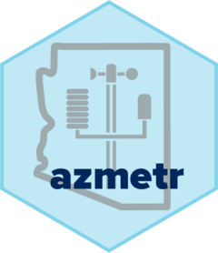

# azmetr 

<!-- badges: start -->
[](https://www.repostatus.org/#active)
[](https://cct-datascience.r-universe.dev)
[](https://github.com/uace-azmet/azmetr/actions/workflows/R-CMD-check.yaml)
[](https://app.codecov.io/gh/uace-azmet/azmetr?branch=main)
[](https://doi.org/10.5281/zenodo.7675685)
<!-- badges: end -->

The goal of azmetr is to provide programmatic access to the [Arizona Meteorological Network](https://azmet.arizona.edu/) (AZMet) [API](https://app.swaggerhub.com/apis/mattjh/AZMetAPI/1.0#/) in R.

## Installation

You can install the development version of `azmetr` from r-universe:

```r
install.packages('azmetr', repos = c('https://cct-datascience.r-universe.dev', 'https://cloud.r-project.org'))
```

Alternatively, you can install a development version directly from GitHub with the `remotes` package:

``` r
# install.packages("remotes")
remotes::install_github("uace-azmet/azmetr")
```


## Example

For the most recent day of data from all stations, run functions without any arguments:

``` r
library(azmetr)

az_daily()
az_hourly()
az_heat()
```

## Code of Conduct
  
  Please note that the `azmetr` project is released with a [Contributor Code of Conduct](https://contributor-covenant.org/version/2/1/CODE_OF_CONDUCT.html). By contributing to this project, you agree to abide by its terms.
