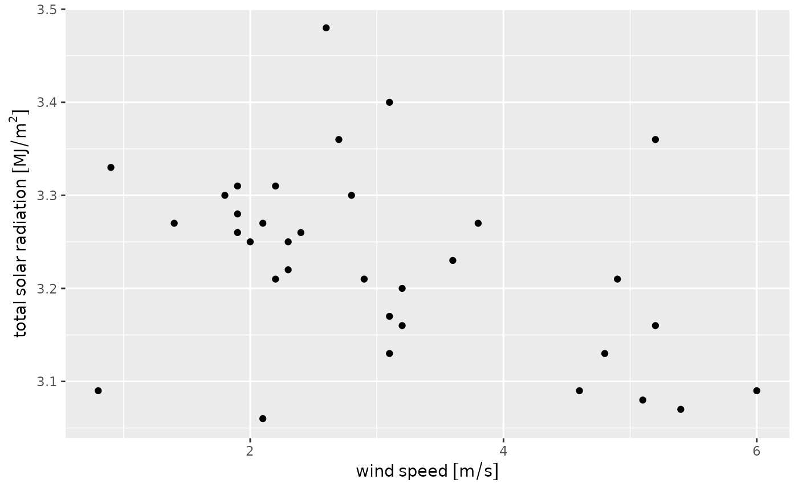

# Using azmetr with the units package

``` r
library(azmetr)
library(units)
#> udunits database from /usr/share/xml/udunits/udunits2.xml
library(dplyr)
#> 
#> Attaching package: 'dplyr'
#> The following objects are masked from 'package:stats':
#> 
#>     filter, lag
#> The following objects are masked from 'package:base':
#> 
#>     intersect, setdiff, setequal, union
```

## Adding units to data

You can add the correct units to data returned by
[`az_daily()`](https://uace-azmet.github.io/azmetr/reference/az_daily.md),
[`az_hourly()`](https://uace-azmet.github.io/azmetr/reference/az_hourly.md),
or
[`az_heat()`](https://uace-azmet.github.io/azmetr/reference/az_heat.md)
by passing the resulting tibble to
[`az_add_units()`](https://uace-azmet.github.io/azmetr/reference/az_add_units.md).

``` r
hourly <- 
  az_hourly() %>% 
  az_add_units() 
#> Querying most recent hour of data ...
#> Warning in az_hourly(): You requested data through 2025-11-20 09:00:00 but only
#> data through 2025-11-20 08:00:00 were available
#> Returning data from 2025-11-20 08:00

hourly %>% 
  select(-starts_with("meta_"), -starts_with("date_")) %>% 
  head()
#> # A tibble: 6 × 33
#>   dwpt  dwptF eto_azmet eto_azmet_in heatstress_cottonC heatstress_cottonF
#>   [°C] [degF]      [mm]         [in]               [°C]             [degF]
#> 1  8.5   47.3         0            0               10.4               50.6
#> 2  7.4   45.3         0            0               10.1               50.3
#> 3  7.5   45.6         0            0                9.1               48.4
#> 4 11.2   52.1         0            0               11.9               53.4
#> 5 11.3   52.3         0            0               12.2               53.9
#> 6  6.1   42.9         0            0                8.1               46.5
#> # ℹ 27 more variables: precip_total [mm], precip_total_in [in],
#> #   relative_humidity [%], sol_rad_total [MJ/m^2], sol_rad_total_ly [langleys],
#> #   temp_airC [°C], temp_airF [degF], temp_soil_10cmC [°C],
#> #   temp_soil_10cmF [degF], temp_soil_50cmC [°C], temp_soil_50cmF [degF],
#> #   vp_actual [kPa], vp_deficit [kPa], wind_2min_spd_max_mph [miles/h],
#> #   wind_2min_spd_max_mps [m/s], wind_2min_spd_mean_mph [miles/h],
#> #   wind_2min_spd_mean_mps [m/s], wind_2min_timestamp <dttm>, …
```

This requires that you have the `units` package installed and will
prompt you to do so if you don’t have it installed. It may also be
helpful to explicitly load the package with
[`library(units)`](https://r-quantities.github.io/units/) so that the
resulting tibble displays the units correctly.

## Using units columns

[`az_add_units()`](https://uace-azmet.github.io/azmetr/reference/az_add_units.md)
converts numeric vectors to those of class “units”. These units columns
behave differently than ordinary numeric vectors and have a few useful
properties. First, you can do unit conversion using
[`set_units()`](https://r-quantities.github.io/units/reference/units.html)
from the `units` package.

``` r
hourly %>% 
  transmute(wind_spd_kph = set_units(wind_spd_mps, "km/h"),
            sol_rad_total = set_units(sol_rad_total, "W h m-2"),
            temp_airK = set_units(temp_airF, "Kelvins"))
#> # A tibble: 34 × 3
#>    wind_spd_kph sol_rad_total temp_airK
#>          [km/h]     [W*h/m^2]       [K]
#>  1         2.88          11.1      283.
#>  2         4.68          36.1      283.
#>  3         5.04          66.7      282.
#>  4         6.84          22.2      285.
#>  5         6.12          22.2      285.
#>  6         5.4           47.2      281.
#>  7         6.84          41.7      283.
#>  8        10.1           58.3      281.
#>  9         0.36          13.9      285.
#> 10         5.76          47.2      282.
#> # ℹ 24 more rows
```

Second, it won’t allow you to do math where the units aren’t compatible.

``` r
hourly %>%  
  transmute(wind_rain = wind_spd_mps + precip_total)
#> Error in `transmute()`:
#> ℹ In argument: `wind_rain = wind_spd_mps + precip_total`.
#> Caused by error:
#> ! cannot convert mm into m/s
```

That also means that you generally cannot add or subtract unitless
constants.

``` r
## This will error:
# hourly$wind_spd_mps[1] + 10

## Must use:
hourly$wind_spd_mps[1] + set_units(10, "m/s")
#> 10.8 [m/s]
```

## Plotting with units

The `units` package works with `ggplot2` to automatically include units
in axis labels.

``` r
library(ggplot2)
ggplot(hourly, aes(x = wind_spd_mps, y = sol_rad_total)) +
  geom_point() +
  labs(x = "wind speed",
       y = "total solar radiation")
```


